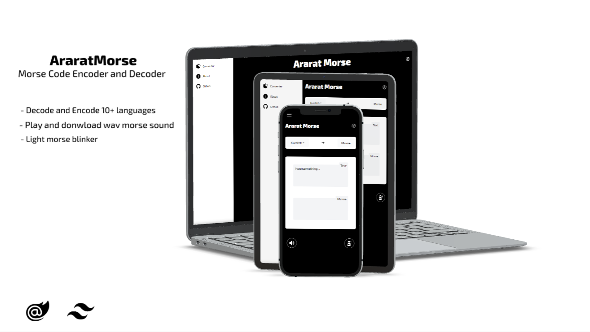

# Ararat Morse

A Morse code converter and trainer that runs in the browser, built with Blazor WebAssembly and the
[MorseSharp](https://github.com/p6laris/MorseSharp) library. Convert text to and from Morse in 11
languages, including Kurdish in both Sorani and Latin script, hear it, see it flash, and practise
copying it until you can read it by ear.

**Try it:** https://p6laris.github.io/AraratMorse/



## Features

**Converter**
- Text to Morse and back in English, Kurdish (Sorani and Latin), Arabic, German, Spanish, French,
  Italian, Japanese, Portuguese and Russian. Right-to-left scripts lay out right-to-left.
- Prosigns such as `<AR>` and `<SK>` key as one unbroken signal; a Prosigns popover lists them.
- History of your recent conversions, and share links that open a conversion as you left it.
- Plain-language error messages that say which character a language can't encode.

**Sound and light**
- Play as audio with tone presets or your own speed, Farnsworth spacing and pitch, and download it
  as a WAV file.
- Play as light: full screen, a signal lamp or a bar, in four colours, with a brightness control,
  the phone's camera flash where the browser allows it, and a Safe mode that shows ON/OFF instead
  of flashing.
- Decode Morse from a WAV file or live from the microphone.

**Practice**
- Koch trainer: learn characters in Koch order, with per-character accuracy, weighted drills and a
  daily streak.
- Callsign and QSO drills: copy real-shaped callsigns and whole contacts, graded word by word.
- Keyer practice: send with a straight key or iambic paddles (modes A and B), with sidetone, and
  see what you sent decoded.
- Custom alphabets: add characters the built-in languages lack.

**Everywhere**
- Installs as an app on phones and desktops, and works offline once installed.
- Keyboard friendly: Space plays or pauses, `/` jumps to the input, Escape closes panels.
- Respects the system "reduce motion" setting.

## Built with

- [Blazor WebAssembly](https://learn.microsoft.com/aspnet/core/blazor/) on .NET 10, compiled ahead of time
- [MorseSharp](https://github.com/p6laris/MorseSharp) 6 for encoding, decoding, audio, light timing and the trainers
- [Tailwind CSS](https://tailwindcss.com/)
- [ClipLazor](https://www.nuget.org/packages/ClipLazor) for the clipboard

## Getting started

You need the [.NET 10 SDK](https://dotnet.microsoft.com/download) and the WebAssembly build tools,
which the ahead-of-time compilation depends on:

```bash
git clone https://github.com/p6laris/AraratMorse.git
cd AraratMorse
dotnet workload install wasm-tools
dotnet run --project AraratMorse
```

### Styles

`AraratMorse/wwwroot/css/app.css` is generated by Tailwind and checked in; `dotnet build` doesn't
produce it. After using a class that isn't in the stylesheet yet, regenerate it from the
`AraratMorse` folder (CI fails if it's out of date):

```bash
npm ci
npx tailwindcss -i Style/style.css -o wwwroot/css/app.css --minify
```

### Deployment

Pushing to `main` publishes the app and deploys it to GitHub Pages. Pull requests and pushes to
`dev` run a build that treats warnings as errors, check the stylesheet, and run the tests.

## Contributing

Fork the repository, make your changes on a branch, and open a pull request. Run the tests
before you push:

```bash
dotnet test
```

`ROADMAP.md` lists what's planned and why.

## License

[MIT](LICENSE.txt)
